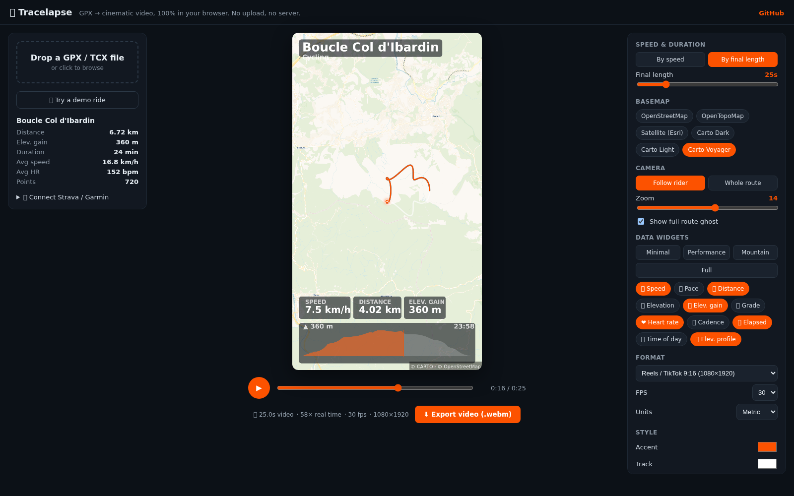

# 🎬 Tracelapse

**Turn your GPS activities into cinematic, fully-configurable videos — 100% in your browser.**
No upload, no server, no account. Your GPX never leaves your machine.



There are plenty of "GPX to video" tools out there, but they're locked down:
fixed speed, fixed layout, watermark, paywall. Tracelapse is the opposite —
every knob is exposed, and the heavy lifting (parsing, map rendering, **video
encoding**) all runs client-side via the Canvas + MediaRecorder APIs.

## Features

- **3D terrain by default** — your route draped over real elevation (Terrarium
  DEM) with a tilted, route-following camera. Toggle tilt & relief boost, or
  switch back to flat 2D.
- **Aerial / satellite basemap by default**, plus OpenStreetMap, OpenTopoMap,
  Carto Dark / Light / Voyager.
- **Drop a GPX or TCX file** (Strava, Garmin, Komoot, Wahoo… all export these).
- **Exponential speed control, ×1 → ×200** — fine at walking pace, huge for long
  rides. Or switch to **"by final length"** and set the exact video duration.
- **Pick what to show** — speed, pace, distance, elevation, elevation gain,
  grade, heart rate, cadence, power, temperature, elapsed time, time of day,
  plus a live **elevation profile** graph. The app auto-detects which streams
  your file actually contains.
- **Predefined widget presets**: Minimal · Performance · Mountain · Full.
- **Camera modes**: follow the rider (with zoom control) or frame the whole route.
- Customisable accent colour, track colour/width, marker size, title, units
  (metric / imperial), resolution (9:16 reels, 16:9, 1:1, 720p) and 24/30/60 fps.
- **Frame-exact export** via WebCodecs (`VideoEncoder` + webm muxer): each frame
  is rendered, waits for tiles + terrain to load, then encoded — so the output
  has the exact requested duration and never a blank frame. Falls back to
  real-time `MediaRecorder` capture where WebCodecs isn't available.

## Quick start

```sh
npm install
npm run dev      # http://localhost:5173
```

Open the app, click **"✨ Try a demo ride"** (or drop your own `.gpx`), tweak,
hit **Export**.

```sh
npm run build    # type-check + production build into dist/
npm run preview  # serve the built app
```

## How it works

```
GPX/TCX ─▶ parser ─▶ metrics (distance, speed, gain, grade, smoothing)
                            │
                       Timeline (real time ⇄ video time, ×N or target length)
                            │
         MapScene (MapLibre GL: aerial basemap + 3D terrain + route + marker)
                            │
            ┌───────────────┴───────────────┐
      live preview                     exporter (frame-step: render →
   (map + overlay canvas)               composite map+overlay → WebCodecs → .webm)
```

The data/overlay layers in `src/core/` are framework-agnostic TypeScript:

| Module | Role |
|---|---|
| `gpx.ts` | Parse GPX & TCX, including Garmin `TrackPointExtension` (hr/cad/power/temp) |
| `metrics.ts` | Cumulative distance, smoothed speed, elevation gain, grade, stats, interpolation |
| `mapscene.ts` | MapLibre controller: aerial raster + Terrarium 3D terrain, route/marker layers, follow/fit camera, frame capture |
| `tiles.ts` | Basemap catalog (raster tile templates + attribution) |
| `timeline.ts` | Maps video time → track index; exponential speed slider helpers |
| `overlay.ts` | Draws title, widget chips and the elevation-profile graph onto a 2D canvas |
| `exporter.ts` | Frame-steps the scene, composites map + overlay, encodes via WebCodecs (MediaRecorder fallback) |
| `widgets.ts` | Widget catalog, availability per activity, value formatting |

The UI (Vue 3) is a thin layer over a single reactive `store`.

## Strava sync

Connect Strava straight from the app: **Connect with Strava → pick an activity →
it loads as a 3D video**. OAuth needs a `client_secret` that can't live in a
static site, so a tiny backend handles the token exchange and turns an activity's
streams into GPX.

Two interchangeable backends ship here:

- **[`server/`](server/)** — a zero-dependency Node service (used in production
  behind Caddy at `/api/*`). Endpoints: `/auth`, `/callback`, `/activities`,
  `/gpx`. Run it with systemd (`server/tracelapse-strava.service`) and a
  root-owned env file (`server/tracelapse-strava.env.example`).
- **[`serverless/`](serverless/)** — the same logic as a Cloudflare Worker, if
  you'd rather not run a server.

Setup: create a Strava API app at <https://www.strava.com/settings/api>, set its
**Authorization Callback Domain** to your host (e.g. `tracelapse.tbrun.dev`), and
put the Client ID + Secret in the backend env. No GPX file? Just connect.

Garmin sync uses the same backend pattern (OAuth 1.0a) — not yet wired; PRs welcome.

## Notes & limits

- Export format is **WebM** (VP9). Convert to MP4 with any tool if a platform
  needs it.
- The WebCodecs path renders frame-by-frame, so export time scales with the GPU:
  near-instant on a modern machine, slower on weak/software GPUs.
- 3D terrain uses public Terrarium DEM tiles and aerial imagery from public
  providers — respect their usage policies; the attribution is baked into every
  frame.

## Tech

Vue 3 · TypeScript · Vite · MapLibre GL JS (3D terrain) · WebCodecs · webm-muxer.
No backend, no tracking — your file never leaves the browser.

## License

MIT © Thibault Brun
